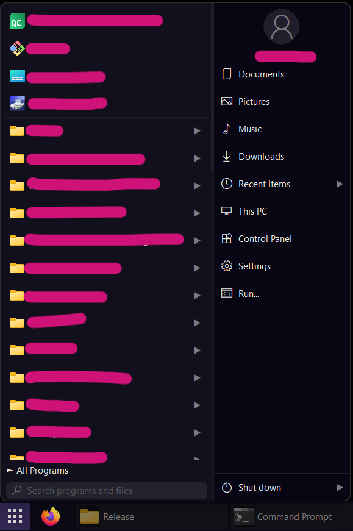

# winzoo

A lightweight taskbar replacement for Windows 10/11, written in C++20 using only Win32 APIs — no third-party libraries, no runtime dependencies beyond what Windows already ships.

When running, winzoo hides the native Windows taskbar and takes its place, reserving the same desktop space via the Windows AppBar API.

<p align="center">
    
</p>

<p align="center">
    
</p>

<p align="center">
    
</p>

## Features

- [x] No nonsense
- [x] *Very* lightweight
- [x] Single executable, no installer needed
- [x] Lots of configurations
- [x] Per monitor DPI aware
- [x] Custom-drawn task buttons with app icon and title
- [x] Custom-drawn apps menu with keyboard navigation and search
- [x] Custom position: top, bottom, left, right, *floating*
- [x] Drag to reorder taskbar buttons
- [x] Pin/unpin separately for each monitor *on the taskbar and on the apps menu*
- [x] Works with Jump Lists and show progress bars for apps that support it
- [x] Settings persisted in the registry
- [x] Easy import/export of settings to share with others or across machines
- [x] And lots more...

## Requirements to use

- Windows 10 or Windows 11

## Export / Import settings

- To export, just select "Export Settings..." on the main taskbar menu
- To import, just place the exported file into the same folder as the executable. On the next run it will import the settings and delete the file

## Build

### Requirements

- Windows 10 or Windows 11
- Visual Studio 2026 (MSVC toolchain)
- CMake 3.20 or newer

### How to

Run `build.bat` from the project root. It configures and builds a Release binary in one step:

```bat
build.bat
```

The executable will be generated as `build\Release\winzoo.exe`.

To build manually:

```bat
cmake -B build -G "Visual Studio 18 2026" -A x64
cmake --build build --config Release
```

> **Note:** The build uses CMake's Visual Studio generator, so no prior `vcvarsall.bat` call is needed — the generator handles the toolchain internally.

## Usage

Launch `winzoo.exe`. The native Windows taskbar is hidden automatically and restored when winzoo exits.

- **Left-click** a button to focus the window; left-click again to minimize it
- **Middle-click** a button to close the window (can be disabled in Settings)
- **Drag** a button left or right to reorder
- **Right-click** a button for per-app options
- **Right-click** the empty area at the end of the bar to open the main menu

To exit cleanly, right-click the taskbar → **Close Taskbar**. This restores the native Windows taskbar before quitting.

## Donations are welcome

If you liked this software and would like to support its development, you can buy me a coffee. Understand that any value is fine and appreciated, and that your support means a lot to me. Thank you!

[Paypal donation](https://www.paypal.com/donate/?business=NUHKNZCBCPCLQ&no_recurring=0&currency_code=USD)


## Check out my other projects

- [qt6appskeleton](https://github.com/riozebratubo/qt6appskeleton): a cross-platform Qt6 app skeleton with sqlite persistence and settings
- [Tilecopy](https://github.com/riozebratubo/tilecopy): a windows local delta file copy tool that supports folders and raw drives
